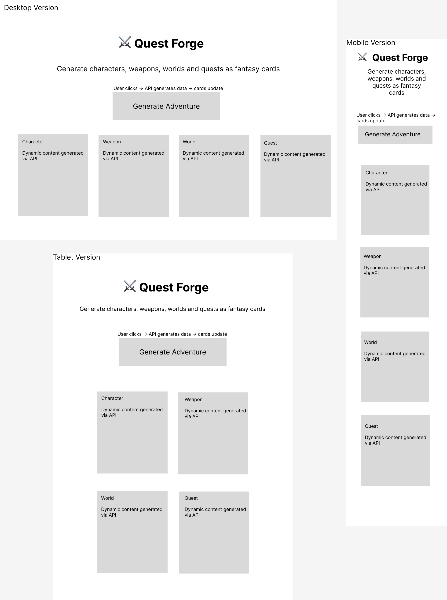
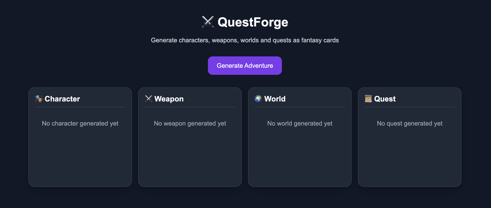
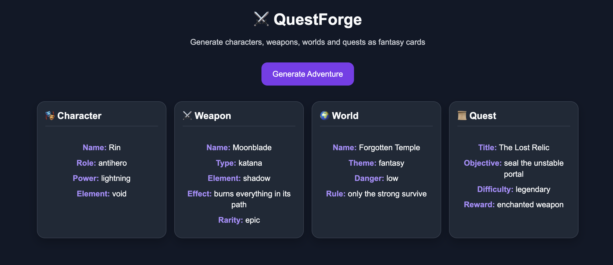

# ⚔️ QuestForge API

A creative Node.js API that generates dynamic characters, weapons, and fantasy worlds inspired by anime, manga, games, and storytelling.

> Built as part of a hackathon challenge to explore backend development with Node.js and Express.

---

## 🧠 Concept

QuestForge is designed as a **creative engine** for generating fantasy content.

Instead of a basic CRUD API, this project focuses on:
- randomness
- procedural generation
- game-inspired logic

It simulates the kind of systems used in:
- RPG games  
- world-building tools  
- storytelling engines  

---

## 🚀 Endpoints

### 🎭 Generate Character
GET /generate/character

### ⚔️ Generate Weapon
GET /generate/weapon

### 🌍 Generate World
GET /generate/world

### 📜 Generate Quest
GET /generate/quest

### 🧬 Generate Full Character
GET /generate/full-character

### 🗺️ Generate Adventure
GET /generate/adventure


---

## 📦 Example Response

```json
{
  "character": {
    "name": "Rin",
    "role": "villain",
    "power": "ice magic",
    "element": "storm"
  },
  "weapon": {
    "name": "Storm Breaker",
    "type": "scythe",
    "element": "ice",
    "effect": "burns everything in its path",
    "rarity": "rare"
  }
}

```

---

## 🛠️ Tech Stack

- Node.js  
- Express.js  
- JavaScript

---

## ▶️ How to Run Locally

```bash
npm install
node index.js

Then open:
http://localhost:3000

```
---

## 🎮 Frontend Preview

This project includes a UI that visualizes the generated data as fantasy cards.

- Click the button → triggers API
- Cards update dynamically
- Simulates a game-like experience

---
## 📸 Screenshots

### 🖥️ Interface
Clean UI layout of the QuestForge generator.



---

### 🎮 Before Generation
Initial state before triggering the API.



---

### ⚡ Generated Adventure
Example of dynamically generated character, weapon, world and quest.



## 💡 Future Improvements

🎯 Quest Generator
🎮 Rarity system (weighted probabilities)
🧾 Swagger / OpenAPI documentation
🌐 Deployment (Render / Vercel)
🎨 Custom user inputs (via query params)

---


👩‍💻 Author
Simona Chiapperino

